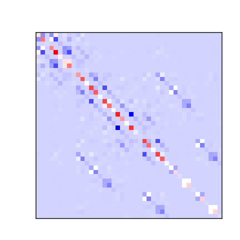

# PySeminario



```
usage: make_ff.py [-h] -i ITP [--fchk FCHK]
                  [--output-parms OUTPUT_PARMS [OUTPUT_PARMS ...]]

Generate force constants based on projections of the Hessian

optional arguments:
  -h, --help            show this help message and exit
  -i ITP, --itp ITP     Name of input .itp file
  --fchk FCHK           Name of formatted checkpoint file to put into output
                        .itp
  --output-parms OUTPUT_PARMS [OUTPUT_PARMS ...]
```
